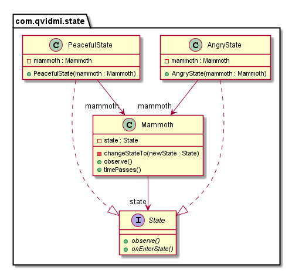

## Also known as
Objects for States

## Intent
Allow an object to alter its behavior when its internal state
changes. The object will appear to change its class.

## Applicability
Use the State pattern in either of the following cases

* an object's behavior depends on its state, and it must change its behavior at run-time depending on that state
* operations have large, multipart conditional statements that depend on the object's state. This state is usually represented by one or more enumerated constants. Often, several operations will contain this same conditional structure. The State pattern puts each branch of the conditional in a separate class. This lets you treat the object's state as an object in its own right that can vary independently from other objects.
